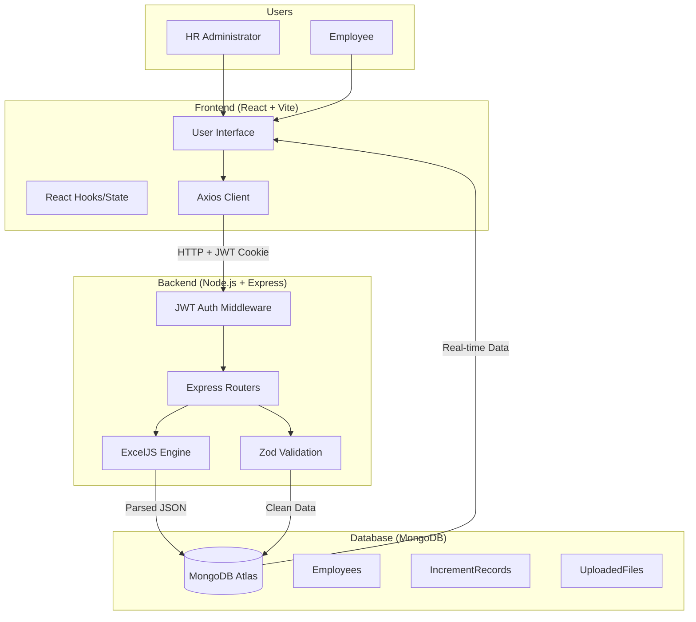
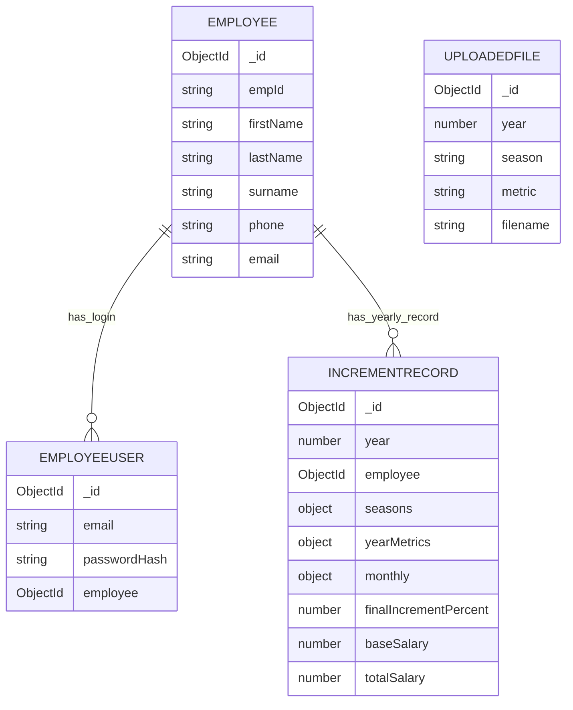

# Project Report: Savan Seed (Payrise)
**Employee Performance & Increment Automation System**

---
# **Project Image**

## 📖 Executive Summary
**Savan Seed (Payrise)** is a specialized enterprise solution designed to automate the annual employee increment calculation process based on sales KPIs. By integrating Excel-based performance tracking with a modern web-based analytics platform, the system eliminates manual calculation errors, ensures data auditability, and provides transparent performance insights to both HR administrators and employees.

---

## 1. Introduction
### 1.1 Problem Statement
In traditional agricultural business management, performance data (KPIs) often exists in fragmented spreadsheets, making it difficult to merge consistently across different seasons (Shiyadu, Unadu, Chomasu) and years. This fragmentation leads to:
- High manual effort for HR during increment cycles.
- Lack of transparency for employees regarding their scores.
- Risk of data entry errors and calculation inconsistencies.

### 1.2 Purpose & Scope
The purpose of Savan Seed is to centralize the performance flow. HR can upload season-wise Excel sheets, and the system automatically:
- Parses complex KPI data (Sales Return, Growth, NRV, Payment Collection).
- Normalizes scores into increment contributions.
- Computes final increment percentages and salary impacts.
- Provides a secure portal for employees to view their results.

---

## 2. Requirements Analysis
### 2.1 User Requirements
- **HR Admin**: Needs tools to upload data, manage templates, track year-over-year growth, and export final reports.
- **Employee**: Needs a secure dashboard to view their personal performance breakdown and update their profile.

### 2.2 System Requirements
- **Functional**: Excel parsing (XLSX), role-based access control (RBAC), automated recomputation, audit logging of uploaded files.
- **Non-Functional**: High security (JWT-based), data consistency (Mongoose validation), responsive UI, and optimized performance for batch processing.

---

## 3. Limitations of Existing System
The previous method of managing employee increments relied heavily on manual spreadsheet entry and siloed data management. Below are the key limitations identified:

| Criteria | Existing Solution (Manual/Spreadsheet) | Impact |
| :--- | :--- | :--- |
| **Scope Limitations** | Restricted to local files only accessible by HR. | No transparency for employees. |
| **Assumptions** | Assumes 100% human accuracy in formula entry. | High risk of calculation errors. |
| **Resource Limitations** | Requires significant man-hours to merge seasonal data. | Delayed increment cycles. |
| **Data Limitations** | Fragmented data across multiple files and folders. | Difficult to maintain historical records. |
| **Methodology** | Inconsistent logic for mapping KPIs to salary. | Potential for bias and disputes. |
| **Technology Constraints** | Static files with no real-time analytics. | Slow decision-making process. |
| **Unforeseen Challenges** | Risk of data loss due to file corruption. | Permanent loss of sensitive payroll data. |

---

## 4. Need for New System / Algorithm
From the limitations identified above, it is evident that a centralized, automated system is required to replace the existing manual workflows. 

### 4.1 Justification of Solution
The **Savan Seed** system introduces a specialized algorithm that automatically maps KPI performance to normalized increment percentages. By transitioning to this new system, the organization achieves:
- **Centralized Data Hub**: A single source of truth for all seasonal performance metrics across years.
- **Automated KPI Engine**: Eliminates human error by using pre-coded mathematical models for Sales Return, Growth, and NRV calculations.
- **Auditability**: Every upload is logged, ensuring that every increment decision is traceable and justifiable.
- **Role-Based Access**: Securely partitions data so that employees can only view their own scores, while HR retains full administrative control.
- **Scalable Infrastructure**: The MERN-based stack allows for thousands of records to be processed and rendered in seconds, providing instant feedback for decision-makers.

---

## 5. System Design & Architecture
### 5.1 Architecture Overview
The system follows a **MERN (MongoDB, Express, React, Node.js)** architecture, designed for scalability and high-speed data processing.

- **Frontend (React/Vite)**: A dynamic SPA using Axios for API communication with `withCredentials` support for secure cookie handling.
- **Backend (Node.js/Express)**: A RESTful API featuring specialized routers for Auth, Employees, Increments, and Templates.
- **Database (MongoDB)**: Utilizes unique indexing and relational references between employees and their performance records.

### 5.2 Data Flow
1. **Ingestion**: HR uploads a season/metric-specific Excel sheet.
2. **Validation**: The backend validates the Excel structure using a template validator.
3. **Processing**: Backend parses the sheet, upserts `Employee` and `IncrementRecord` documents.
4. **Computation**: The system recomputes seasonal, yearly, and final increment percentages.
5. **Persistence**: Results are stored alongside upload metadata for audit trails.
6. **Rendering**: The UI refreshes with real-time analytics and detailed tables.

---

## 6. Implementation Details
### 6.1 Technology Stack
- **Frontend**: React 18, Vite, Lucide Icons, Vanilla CSS (Premium Glassmorphic Design).
- **Backend**: Node.js, Express, Multer (File Handling), ExcelJS (Data Extraction).
- **Security**: JWT (Stored in httpOnly Cookies), Bcrypt (Password Hashing), Helmet, CORS.
- **Validation**: Zod (Schema enforcement).

### 6.2 Increment Calculation Logic (The Engine)
The system employs a sophisticated mapping logic to convert raw KPIs into increment %:
- **Sales Return**: Reversed rule (Higher return = Lower increment). Max 18%.
- **Sales Growth**: Linear mapping up to 36% (Clamped 0-200%).
- **NRV & Payment Collection**: Linear mapping up to 18% each.
- **Activity**: Computed from monthly data, mapped up to 18%.
- **Formula**: `Final % = (Return + Growth + NRV + Collection + Activity) / 5`.

---

## 7. Database Schema
The system uses a highly structured MongoDB schema to handle complex performance calculations and audit trails.

### 7.1 Entity Relationship Diagram (ERD)
The following diagram illustrates the core relationships between employees, their login accounts, and their yearly performance records.

### 7.2 Core Collections

#### 1. `employees`
The master repository of staff profiles.
- **Key Fields**: `empId` (Unique), `firstName`, `lastName`, `surname`, `phone`, `email`.
- **Integrity**: Enforces unique `empId` to prevent duplication during Excel uploads.

#### 2. `employeeusers`
Authentication table for employee portal access.
- **Key Fields**: `email` (Username), `passwordHash` (Bcrypt), `employee` (Ref to `employees._id`).

#### 3. `incrementrecords`
The central engine where all performance data and salary results are stored.
- **Structure**: Uses nested objects for `seasons` (Shiyadu, Unadu, Chomasu) and `monthly` activity.
- **Logic**: A unique compound index on `{ year, employee }` ensures that each employee has exactly one record per fiscal year.

#### 4. `uploadedfiles`
The audit trail for all data ingestions.
- **Purpose**: Tracks every Excel file uploaded, storing its location, original name, and the specific year/season/metric it updated.

#### 5. `hrusers`
Restricted access table for administrative staff.

#### 6. `years`
Configuration table for managing the list of available fiscal years.

---

## 8. Security & Performance
### 8.1 Security Measures
- **RBAC**: Routes are strictly guarded by `requireAuth` and `requireHr` middlewares.
- **Cookie Security**: JWT tokens are stored in `httpOnly` and `Secure` cookies to prevent XSS attacks.
- **Password Safety**: All passwords are encrypted using salt-and-hash techniques with Bcrypt.

### 8.2 Performance Optimization
- **Batch Processing**: Uses efficient loops and Mongoose upserts for large Excel files.
- **Indexing**: Database queries are optimized via indexing on `year`, `season`, and `employee` fields.
- **Lean Reads**: Frontend requests utilize `.lean()` queries to minimize server memory footprint.

---

## 9. Testing & Error Handling
- **Structure Validation**: Prevents ingestion of incorrectly formatted Excel files.
- **Mismatch Detection**: Blocks data uploads if the file year doesn't match the dashboard selection.
- **Graceful Failure**: Automatic cleanup of temporary files if a processing error occurs.
- **User Feedback**: Human-readable error messages for authentication and validation failures.

---

## 10. Conclusion & Future Scope
### 10.1 Conclusion
Savan Seed (Payrise) successfully transforms a manual, error-prone payroll process into a streamlined, digital workflow. It provides a robust foundation for agricultural enterprise management.

### 10.2 Future Scope
- **Automated Queues**: Moving Excel processing to background workers for massive datasets.
- **Multi-Tenant Support**: Allowing the system to handle multiple branches or organizations.
- **Mobile Integration**: Developing a dedicated mobile app for field employees.
- **Advanced Exporting**: PDF generation for official increment letters and salary slips.

---

**Created by  Jagdish2401/savan_seed**
