# Savan Payrise — MongoDB Schema (From Code)

This schema is derived from the backend Mongoose models in `backend/src/models/*`.

## Collections

## 1) `employees`
**Purpose:** Master list of employees used across calculations and logins.

**Fields**
- `name` (String, required, unique)
- `surname` (String, default "")
- `phone` (String, default "")
- `createdAt`, `updatedAt`

**Notes**
- `name` is unique in the schema.

---

## 2) `employeeusers`
**Purpose:** Employee login accounts.

**Fields**
- `email` (String, required, unique, lowercase)
- `passwordHash` (String, required; bcrypt)
- `employee` (ObjectId → `employees._id`, required)
- `createdAt`, `updatedAt`

**Relationship**
- Many `employeeusers` → one `employees` (effectively one-to-one in practice).

---

## 3) `hrusers`
**Purpose:** HR login accounts.

**Fields**
- `email` (String, required, unique, lowercase)
- `passwordHash` (String, required; bcrypt)
- `createdAt`, `updatedAt`

---

## 4) `incrementrecords`
**Purpose:** The computed truth for a given employee in a given year.

**Unique Key / Index**
- Unique compound index: `{ year: 1, employee: 1 }`

**Top-level fields**
- `year` (Number, required, indexed)
- `employee` (ObjectId → `employees._id`, required)

### Embedded: `seasons`
Three season buckets: `shiyadu`, `unadu`, `chomasu`

Each season contains:
- `salesReturn`: `{ pct: Number|null, inc: Number|null }`
- `salesGrowth`: `{ pct: Number|null, inc: Number|null }`
- `nrv`: `{ pct: Number|null, inc: Number|null }`
- `paymentCollection`: `{ pct: Number|null, inc: Number|null }`
- `seasonInc` (Number|null)

### Embedded: `yearMetrics`
- `salesReturnInc` (Number|null)
- `salesGrowthInc` (Number|null)
- `nrvInc` (Number|null)
- `paymentCollectionInc` (Number|null)

### Embedded: `monthly.activity`
Monthly activity is stored as:
- `monthly.activity.m1 ... m12` each is `{ pct: Number|null, inc: Number|null }`

### Embedded: `activity`
Year-level activity rollup:
- `activity`: `{ pct: Number|null, inc: Number|null }`

### Behaviour bonus (optional)
- `behaviourBonus` (Number, default 0)
- `behaviourBonusApplied` (Boolean, default false)

### Final results
- `finalIncrementPercent` (Number|null)

### Salary fields
- `baseSalaryManual` (Number|null)
- `baseSalary` (Number|null)
- `baseSalarySource` ("manual" | "previousYear")
- `incrementAmount` (Number|null)
- `totalSalary` (Number|null)

---

## 5) `uploadedfiles`
**Purpose:** Metadata/audit trail for the Excel file used for a year/season/metric.

**Unique Key / Index**
- Unique compound index: `{ year: 1, season: 1, metric: 1 }`

**Fields**
- `year` (Number, required, indexed)
- `season` (Enum: `shiyadu | unadu | chomasu`)
- `metric` (Enum: `salesReturn | salesGrowth | nrv | paymentCollection | combined`)
- `filename` (String)
- `originalName` (String)
- `path` (String)
- `mimetype` (String)
- `size` (Number)
- `createdAt`, `updatedAt`

---

## 6) `years`
**Purpose:** Optional manual list of available years (in addition to years that exist from increment records).

**Fields**
- `year` (Number, required, unique, min 2000, max 2100)
- `createdAt`, `updatedAt`

---

## Relationships (ER Diagram)

```mermaid
erDiagram
  EMPLOYEE ||--o{ EMPLOYEEUSER : has_login
  EMPLOYEE ||--o{ INCREMENTRECORD : has_yearly_record

  EMPLOYEE {
    ObjectId _id
    string name
    string surname
    string phone
    date createdAt
    date updatedAt
  }

  EMPLOYEEUSER {
    ObjectId _id
    string email
    string passwordHash
    ObjectId employee
    date createdAt
    date updatedAt
  }

  HRUSER {
    ObjectId _id
    string email
    string passwordHash
    date createdAt
    date updatedAt
  }

  INCREMENTRECORD {
    ObjectId _id
    number year
    ObjectId employee
    object seasons
    object yearMetrics
    object monthly
    object activity
    number behaviourBonus
    boolean behaviourBonusApplied
    number finalIncrementPercent
    number baseSalaryManual
    number baseSalary
    string baseSalarySource
    number incrementAmount
    number totalSalary
    date createdAt
    date updatedAt
  }

  UPLOADEDFILE {
    ObjectId _id
    number year
    string season
    string metric
    string filename
    string originalName
    string path
    string mimetype
    number size
    date createdAt
    date updatedAt
  }

  YEAR {
    ObjectId _id
    number year
    date createdAt
    date updatedAt
  }
```



## IncrementRecord Document Shape (Example)

```json
{
  "year": 2026,
  "employee": "<EmployeeId>",
  "seasons": {
    "shiyadu": {
      "salesReturn": { "pct": 3.2, "inc": 12.24 },
      "salesGrowth": { "pct": 140, "inc": 25.2 },
      "nrv": { "pct": 80, "inc": 14.4 },
      "paymentCollection": { "pct": 90, "inc": 16.2 },
      "seasonInc": 17.01
    },
    "unadu": { "...": "..." },
    "chomasu": { "...": "..." }
  },
  "yearMetrics": {
    "salesReturnInc": 10.5,
    "salesGrowthInc": 18.2,
    "nrvInc": 12.1,
    "paymentCollectionInc": 14.3
  },
  "monthly": {
    "activity": {
      "m1": { "pct": 70, "inc": 12.6 },
      "m2": { "pct": null, "inc": null }
    }
  },
  "activity": { "pct": 55.83, "inc": 10.05 },
  "behaviourBonus": 1,
  "behaviourBonusApplied": true,
  "finalIncrementPercent": 14.93,
  "baseSalarySource": "previousYear",
  "baseSalary": 300000,
  "incrementAmount": 44790,
  "totalSalary": 344790
}
```

## Integrity Rules Implemented in Code (Important)
- `incrementrecords` is unique per `(year, employee)`.
- Missing seasonal metrics are treated as `0` during computation.
- Missing seasons are treated as `0` during yearly metric rollup.
- Activity months missing are treated as `0` for yearly activity.
- If previous year `totalSalary` exists, base salary is locked from it (source = `previousYear`).
